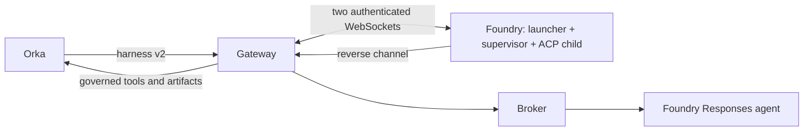

# Run the v2 supervisor in Foundry

`Dockerfile.hosted` packages this adapter and Orka's Linux supervisor as a
Foundry Hosted Agent. Orka reaches it through a single-replica gateway in
Kubernetes. The [Foundry lifecycle broker](harness-v2.md) runs beside that
gateway and owns the downstream Responses agent's sessions.



The hosted launcher exposes `GET /readiness` and `/invocations_ws`. Foundry's
endpoint must advertise `invocations_ws` version `2.0.0` and use Entra
authorization. The gateway carries HTTP/2 inside the two WebSockets, preserving
v2 authentication, operation capabilities, fences, streaming responses and
HTTP status codes. It does not retry or reconnect after a channel failure.

## Build

First build the configured ACP image and Orka composition as described in
[harness-v2.md](harness-v2.md). The baked `/agent/foundry.json` selects the
downstream Responses agent, model, and tool schema mode.

Create a public `hosted.json` with these fields:

| Field | Value |
| --- | --- |
| `protocol` | `orka.foundry.hosted.v1` (the transport bootstrap protocol). |
| `deploymentID` | A new canonical UUID for this deployment. |
| `target` | `projectEndpoint`, `agentName`, and concrete `agentVersion` of the **supervisor's** Hosted Agent. |
| `signingPublicKey` | Ed25519 public key, unpadded URL-safe base64, exactly 32 decoded bytes. |
| `agentConfigurationDigest` | SHA-256 of the exact `/agent/foundry.json` bytes, prefixed with `sha256:`. |

Keep the signing private key outside every build context. Only the public
configuration belongs in the hosted image. Create a new deployment identity
and key when replacing a hosted lifetime.

```sh
docker buildx build --builder remote-vm --platform linux/amd64 \
  -f Dockerfile.hosted \
  --build-arg ORKA_RUNTIME_IMAGE=<composed-runtime>@sha256:<digest> \
  --build-arg FOUNDRY_ADAPTER_DIGEST=sha256:<configured-acp-image-digest> \
  --build-arg HOSTED_CONFIG=<public-config-path-in-build-context> \
  --provenance=false --push -t <registry>/foundry-hosted:<tag> .
```

Publish the resulting digest as the exact Foundry agent version in `target`.
Use Linux amd64, `PORT=8088`, and root for the launcher and supervisor. The
supervisor assigns a distinct UID/GID to each ACP child. The image uses the
filesystem exercised by the hosted platform probe; a distroless filesystem
failed to start in that environment.

## Gateway

Run the configured ACP image in Kubernetes with:

```text
/agent-runtime-foundry --protocol hosted-gateway --config /etc/orka-foundry/gateway.json
```

The public gateway configuration contains:

| Field | Value |
| --- | --- |
| `protocol` | `orka.foundry.hosted.v1`. |
| `image` | The complete public `hosted.json` object baked into the hosted image. |
| `containerImage` | Exact digest-pinned image in the Foundry version. |
| `sessionID` | A new canonical UUID, chosen before any session creation. |
| `runtimeProfileDigest` | Expected canonical Orka v2 profile digest. |
| `runtimeEnvironment` | The fixed supervisor profile and fence settings below. |
| `orkaBaseURL` | Fixed Orka API origin, for example `http://orka-api.orka-system.svc:8080`. |
| `brokerBaseURL` | Loopback broker origin, for example `http://127.0.0.1:8091`. |

`runtimeEnvironment` requires `ORKA_ACP_PROVIDER=foundry`, model, adapter digest,
agent configuration digest, tool/approval/MCP policy digests, workspace intent,
`ORKA_ACP_PROXY_CREDENTIAL_ROLE=operator-managed`,
`ORKA_ACP_PROXY_CREDENTIAL_SCOPE=external-runtime`,
`ORKA_ACP_RESOURCE_CLASS=external`, trust namespace, controller epoch, runtime
pool UUID and generation. These use the supervisor variable names documented
by Orka. Optional model context/output limits must be supplied together.
The launcher controls addresses, session directories, boot identity and
credentials; they cannot be overridden through this map.

Mount these gateway-only files from Kubernetes Secrets:

| Gateway variable | File contents |
| --- | --- |
| `ORKA_FOUNDRY_GATEWAY_SIGNING_KEY_FILE` | Unpadded URL-safe base64 of the 64-byte Go Ed25519 private key (seed followed by public key), without a newline. |
| `ORKA_FOUNDRY_GATEWAY_CONTROLLER_TOKEN_FILE` | Orka controller bearer, at least 32 bytes. |
| `ORKA_FOUNDRY_GATEWAY_CAPABILITY_SECRET_FILE` | Orka operation capability signing secret, at least 32 bytes. |
| `ORKA_FOUNDRY_GATEWAY_PROVIDER_TOKEN_FILE` | Bearer for the adjacent Foundry broker, at least 32 bytes. |

Set `ORKA_FOUNDRY_GATEWAY_STATE_DIR` to a private `0700` subdirectory of a
persistent volume. `ORKA_FOUNDRY_GATEWAY_ADDR` defaults to `:8080`.
Give the gateway and broker refreshable Azure Workload Identity. The broker
uses a separate persistent directory and the same baked `foundry.json`.
Use one replica and `Recreate`; never share either ledger between active
writers. `/healthz` becomes ready after bootstrap and profile verification.

Register the gateway Service as Orka's external `orka.harness.v2` AgentRuntime.
Use the configured ACP image digest as `foundry-serve-acp`'s adapter digest.
Do not set Kubernetes supervisor-recovery metadata: the supervised process
runs in Foundry. Orka's operation credentials still protect every status or
mutation request. Only health and capabilities are safe unauthenticated probes.

## Ownership and failure behavior

The gateway verifies the immutable image/version and exact session, and pins
the Azure caller identity. It authenticates both channel roles against one
boot nonce and bootstrap digest. Before sending credentials it fsyncs possible
delivery in its ledger. A gateway restart after that point refuses to seed
another supervisor, even when the earlier acknowledgment was lost.

Loss of either channel, supervisor exit, Foundry stop/resume, or a container
replacement closes the hosted lifetime. No automatic respawn or session
adoption occurs. In-flight operations may have an unknown outcome. Preserve
both ledgers and use confirmed Orka drain/retirement before replacing a
surviving runtime. After supervisor loss, the current v2 contract cannot
import the old broker's retirement proof; unresolved work remains
`OutcomeUnknown`. A new session ID does not establish that old work stopped.

The broker settles fully completed foreground Responses from their validated,
durable completion records. It keeps the downstream session running so a
backend can retain conversation history in memory. Interrupted requests still
require remote containment, and session retirement requires confirmed deletion.
Session creation already recorded as an intent gets one bounded attempt that
survives prompt cancellation, so its acknowledgment can be retained without
submitting inference for a cancelled prompt. A lost acknowledgment remains
unresolved ownership.

Microsoft documents an approximately **30-minute maximum connection duration**
for `invocations_ws`, after which Foundry closes the WebSocket with code `1001`.
This connection limit is separate from the session idle timeout; recent Tasks,
tool calls, or keepalive traffic do not establish that a connection can outlive
it. See [Maximum connection duration](https://learn.microsoft.com/en-us/azure/foundry/agents/how-to/build-voice-agent#maximum-connection-duration).

Both channel roles belong to one hosted lifetime. A platform close on either
role makes the gateway unavailable and cancels and joins supervisor shutdown.
The gateway does not reconnect, replay an uncertain operation, or reseed the
same ledger after restart. Plan drain and confirmed retirement before the
connection limit, allowing time for cleanup; this package does not support an
indefinitely running hosted supervisor. No application keepalive is sent over
idle channels, so an idle timeout can also end the lifetime earlier.

Each channel emits one close summary containing only its role, local WebSocket
upgrade time (`opened_at`), elapsed milliseconds (`duration_ms`), and numeric
`close_code`. The code is `0` when no close code was observed before local
closure; `1006` can indicate abnormal EOF without a received close frame.
Peer close text, raw errors, endpoint URLs, and credentials are not logged.
These observations help distinguish a received platform `1001` from an
unclassified local close; elapsed time alone does not prove the cause.

Bootstrap secrets and supervisor session files stay outside Foundry `HOME`,
which is exposed through its Session Files API. ACP children inherit neither
Azure identity nor gateway/broker/controller credentials. Reverse requests
preserve their original authorization; the gateway never adds a broker token
based on unsigned context. Only the fixed broker lifecycle and Orka MCP/artifact
routes are reachable through the reverse channel.

The existing Foundry ACP limitations still apply: text/resource-link input,
brokered tools, no per-Task configuration, and no approval-required tools.
Use the Orka harness v2 conformance suite for v2 claims; this repository's
`conformance/` package tests harness v1.
